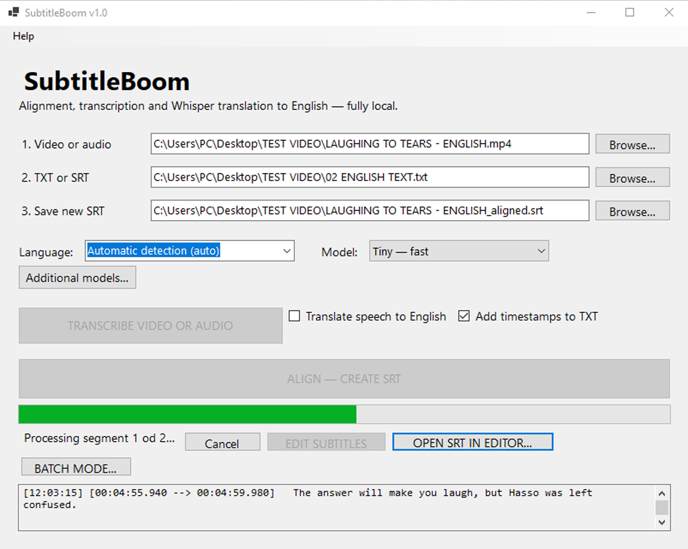
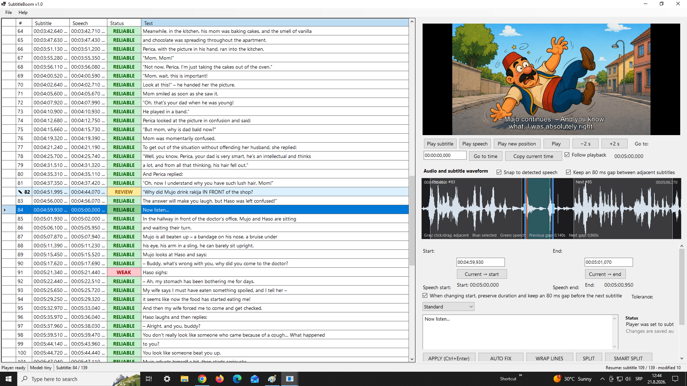
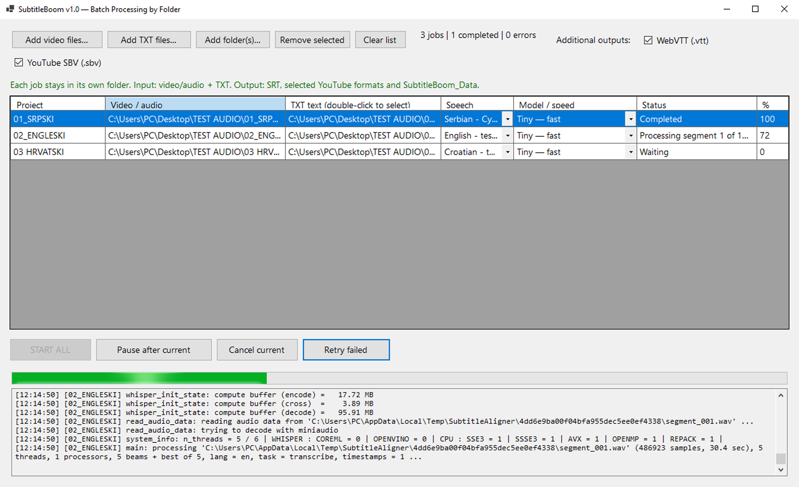

# SubtitleBoom v1.0 — First Public Release

SubtitleBoom is a free and open-source Windows desktop application for subtitle alignment, transcription, translation, and subtitle editing.

It is designed to work locally on your computer and combines automatic speech processing with a built-in subtitle editor.

## Screenshots

### Main window

### Subtitle editor

### Batch processing

## Features

* Automatic subtitle-to-speech alignment
* Built-in subtitle editor
* Audio waveform and detected-speech visualization
* Video and audio preview
* Offline speech transcription using whisper.cpp
* Speech translation to English
* Automatic processing-language detection
* SRT and TXT workflows
* Optional timestamps in TXT transcription
* Batch processing of multiple projects
* YouTube subtitle output support
* Local project data and reusable processing results
* Multiple interface languages
* Tiny and Base Whisper models included in the standard offline package
* Additional Whisper models can be used when available locally
* Designed to work without an Internet connection once the package has been extracted

## Release status

This repository contains the release-ready source baseline for SubtitleBoom v1.0.

* Application: `SubtitleBoom.exe`
* Version: `1.0.0`
* Project data: `SubtitleBoom_Data`
* Default UI language: English
* Processing language default: automatic detection
* Target platform: Windows x64
* Target framework: .NET 8 (`net8.0-windows`)
* Offline runtime: whisper.cpp, Whisper model files, and an LGPL-compatible FFmpeg build

## Download

The ready-to-use Windows x64 version is available from the GitHub Releases section.

For the first public release, download:

`SubtitleBoom_v1.0_Windows_x64.zip`

Extract the archive and run `SubtitleBoom.exe`.

The release package contains the runtime components and standard Whisper models required for offline operation.

## Build from source

On Windows, run `BUILD.bat` from the source-package root.

The build script:

1. checks the installed .NET SDK;
2. validates the bundled whisper.cpp runtime;
3. validates that the bundled FFmpeg does not report `--enable-gpl` or `--enable-nonfree`;
4. prepares the Tiny and Base Whisper models from local files only;
5. publishes the Windows x64 application into the `PROGRAM` folder;
6. copies the project license, third-party notices, third-party license texts, and donation configuration into the published package.

The build workflow itself does not download runtime components or models.

> **Offline build note:** The bundled whisper.cpp runtime, FFmpeg, Tiny/Base models, and SubtitleBoom source do not require an Internet connection during the build. A compatible .NET SDK must already be installed. `dotnet restore` may require Internet access if the required NuGet packages are not already available in the local NuGet cache.

## Documentation

User documentation is available in the `docs` folder.

Interface language packs are stored in the `languages` folder.

## Donation

SubtitleBoom is free and open-source software. If you find it useful and would like to support its development, voluntary donations are welcome.

Official PayPal.Me link:

https://paypal.me/VladicaMilosavljevic

The application reads the same link from `config/donation.txt`.

## License

SubtitleBoom source code is released under the MIT License. See `LICENSE`.

Third-party components remain under their respective licenses. See `THIRD_PARTY_LICENSES.txt` and the `third_party_licenses` folder.

## Third-party components

SubtitleBoom uses or references, among other components:

* whisper.cpp / GGML runtime — MIT
* OpenAI Whisper model weights — MIT
* FFmpeg — LGPL-compatible build used as a separate executable
* LibVLCSharp.WinForms — LGPL 2.1
* VideoLAN.LibVLC.Windows 3.0.23.1 — LGPL 2.1 or later

For the exact FFmpeg build identifier and source-compliance information, see:

* `runtime/bin/FFMPEG_BUILD_INFO.txt`
* `third_party_licenses/FFMPEG_SOURCE_NOTICE.txt`
* `third_party_licenses/LGPL-3.0.txt`

## Important redistribution note

If you redistribute a SubtitleBoom binary package that includes FFmpeg or libVLC binaries, retain the applicable third-party notices and license texts.

For FFmpeg, make the complete corresponding source for the exact distributed build available in accordance with the applicable LGPL requirements and FFmpeg's redistribution guidance.

Do not remove `LICENSE`, `THIRD_PARTY_LICENSES.txt`, or `third_party_licenses` from redistributed binary packages.

## Release assets

The public SubtitleBoom v1.0 release provides:

1. `SubtitleBoom_v1.0_Windows_x64.zip` — tested Windows x64 binary package.
   - SHA-256: `1a9e1065c33fe9c72f6528527a1034568f9b1afa51d71a5bb1b82af27ef25504`

2. `SubtitleBoom_v1.0_Source.zip` — release-ready SubtitleBoom v1.0 source package with the bundled runtime components and standard Tiny/Base Whisper models required by the offline build workflow.
   - SHA-256: `4dff0a86219badd1c5ab89a8347b83f2d3a5476b1da7a9d445b78fbaed2c18ab`

3. `FFmpeg_Source_and_Compliance_SubtitleBoom_v1.0_FINAL.zip` — corresponding FFmpeg source and compliance-support material for the bundled FFmpeg build.
   - SHA-256: `7c28e8354b1c50765a31d11ac7ea3f58d3a129b6063a108e6b73c34c7bb4ac9c`

GitHub also automatically provides source-code archives for the `v1.0` tag.
